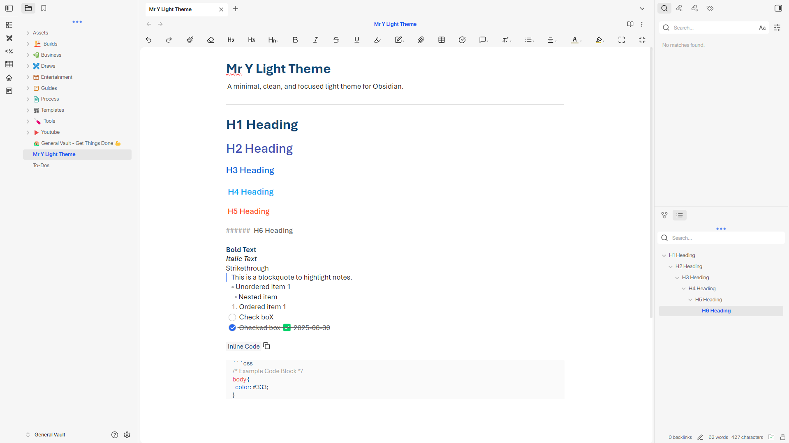

# Mr. Y Light Theme
A clean, minimal, and focused light theme for [Obsidian](https://obsidian.md).  
Designed for distraction-free note-taking with a modern, elegant aesthetic.

## ✨ Features
- Minimal and focused design
- Optimized for readability
- Consistent light palette
- Subtle accents and balanced typography

### 🔧 Customization
Adjustable font, and accent color.

## 📥 Installation

### From Obsidian Community Themes
Available Soon

### Manual Install
1. Clone this repository.
2. Place `manifest.json` and `theme.css` in your Obsidian vault under:  
   `.obsidian/themes/MrY-Light/`
3. In Obsidian, go to **Settings → Appearance → Themes**, then select it.

## 🤝 Contributing
Contributions, issues, and feature requests are welcome!  
Feel free to open an issue or submit a pull request.

